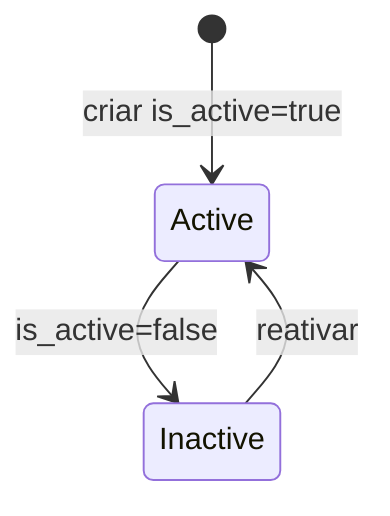

# Business

Conta principal do cliente. Exemplo: administradora que opera varios condominios.

## Caso de uso

```text
Superadmin acessa Admin/API
-> cria Business
-> sistema passa a permitir criacao de Tenants nesse Business
-> admin do business pode receber acesso
```

## Diagrama de estado



## Modelos

Origem: `tenants.models.Business`.

Campos principais:

- `name`: nome comercial.
- `legal_name`: razao social.
- `document`: CNPJ/documento.
- `is_active`: controla se o business esta ativo.
- `created_at`, `updated_at`: auditoria temporal.

Relacionamentos:

- `Tenant.business`: tenants pertencem a um business.
- `UserTenantAccess.business`: acessos sao escopados por business.
- `UserProfile.business`: admin pode gerenciar todos os tenants do business.

## Exemplos

```python
from tenants.models import Business

business = Business.objects.create(
    name="Portarias Inteligentes LTDA",
    legal_name="Portarias Inteligentes LTDA",
    document="12345678000199",
    is_active=True,
)
```

## JSON e API

```http
POST /api/v1/tenancy/businesses/
Authorization: Bearer eyJ...
Content-Type: application/json

{
  "name": "Portarias Inteligentes LTDA",
  "legal_name": "Portarias Inteligentes LTDA",
  "document": "12345678000199",
  "is_active": true
}
```

Endpoints:

- `GET /api/v1/tenancy/businesses/`
- `POST /api/v1/tenancy/businesses/`
- `GET /api/v1/tenancy/businesses/{id}/`
- `PATCH /api/v1/tenancy/businesses/{id}/`
- `DELETE /api/v1/tenancy/businesses/{id}/`
