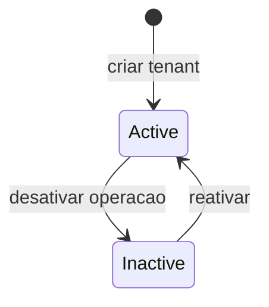

# Tenant

Cliente ou unidade dentro do Business. Exemplo: um condominio.

## Caso de uso

```text
Admin do business cria Tenant
-> vincula cameras/gateways/placas ao tenant
-> usuarios staff recebem UserTenantAccess
-> dados operacionais ficam separados por tenant_id
```

## Diagrama de estado



## Modelos

Origem: `tenants.models.Tenant`.

Campos principais:

- `business`: business dono do tenant.
- `name`, `slug`, `document`, `location`: identificacao da unidade.
- `timezone`: fuso horario operacional.
- `is_active`: controla se a unidade esta ativa.
- `created_at`, `updated_at`: auditoria temporal.

Relacionamentos:

- Cameras, gateways, registros de placas, eventos, alertas e objetos LGPD podem apontar para `tenant`.
- A visibilidade na API usa `tenant_id` por query string ou `X-Tenant-ID` em varios endpoints.

## Exemplos

```python
from tenants.models import Business, Tenant

business = Business.objects.get(name="Portarias Inteligentes LTDA")
tenant = Tenant.objects.create(
    business=business,
    name="Condominio Jardim Azul",
    slug="cond-jardim-azul",
    timezone="America/Sao_Paulo",
)
```

## JSON e API

```http
POST /api/v1/tenancy/tenants/
Authorization: Bearer eyJ...
Content-Type: application/json

{
  "business": 1,
  "name": "Condominio Jardim Azul",
  "slug": "cond-jardim-azul",
  "document": "98765432000188",
  "location": "Rua Azul, 100",
  "timezone": "America/Sao_Paulo",
  "is_active": true
}
```

Endpoints:

- `GET /api/v1/tenancy/tenants/`
- `POST /api/v1/tenancy/tenants/`
- `GET /api/v1/tenancy/tenants/{id}/`
- `PATCH /api/v1/tenancy/tenants/{id}/`
- `DELETE /api/v1/tenancy/tenants/{id}/`
- `GET /api/v1/tenancy/my-tenants/`
