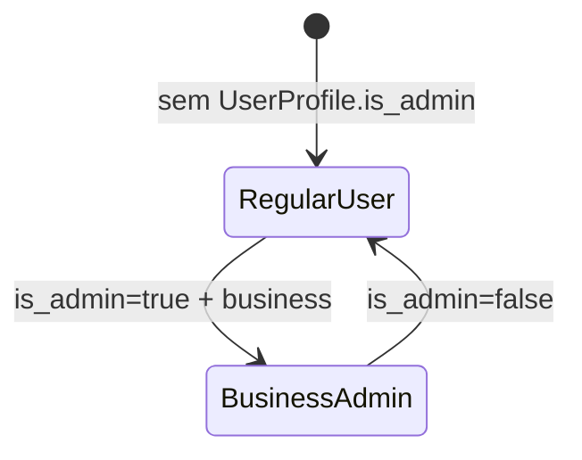

# UserProfile

Perfil extra do usuario Django. Define se ele e admin de um business.

## Caso de uso

```text
Superadmin abre Usuario no Admin
-> cria/edita UserProfile
-> marca is_admin=true e escolhe Business
-> usuario passa a ver todos os Tenants daquele Business
```

## Diagrama de estado



## Modelos

Origem: `tenants.models.UserProfile`.

Campos principais:

- `user`: usuario Django, relacionamento um-para-um.
- `business`: business administrado pelo usuario.
- `is_admin`: habilita administracao de todos os tenants do business.
- `created_at`, `updated_at`: auditoria temporal.

Efeito operacional:

- `tenants_visible_for_user(user)` retorna todos os tenants do business quando `is_admin=True`.
- Nao existe serializer/API REST publica para criar `UserProfile`; o uso principal e via Admin Django ou codigo interno.

## Exemplos

```python
from django.contrib.auth import get_user_model
from tenants.models import Business, UserProfile

User = get_user_model()
user = User.objects.get(username="ana")
business = Business.objects.get(name="Portarias Inteligentes LTDA")

UserProfile.objects.update_or_create(
    user=user,
    defaults={"business": business, "is_admin": True},
)
```

```python
from tenants.utils import tenants_visible_for_user

tenants = tenants_visible_for_user(user)
```

## JSON e API

Sem endpoint REST direto. Para conceder acesso operacional a tenant/business use `UserTenantAccess`:

```http
POST /api/v1/tenancy/grant-access/
Authorization: Bearer eyJ...
Content-Type: application/json

{
  "business": 1,
  "tenant": null,
  "role": "admin",
  "email": "ana@example.com"
}
```
