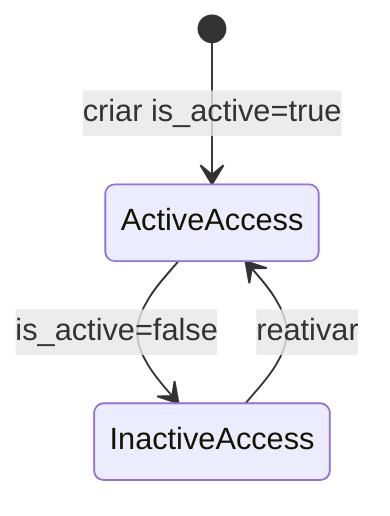

# UserTenantAccess

Vincula usuario a um tenant especifico ou a todos os tenants de um business.

## Caso de uso

```text
Admin do business acessa grant-access
-> informa email, business, tenant e role
-> sistema cria usuario se nao existir
-> sistema cria UserTenantAccess
-> usuario passa a acessar admin/API conforme escopo
```

## Diagrama de estado



## Modelos

Origem: `tenants.models.UserTenantAccess`.

Campos principais:

- `user`: usuario Django.
- `business`: business do acesso.
- `tenant`: tenant especifico; quando vazio significa todos os tenants do business.
- `role`: `owner`, `admin`, `operator` ou `viewer`.
- `is_active`: ativa ou suspende o acesso.
- `created_at`, `updated_at`: auditoria temporal.

Regra unica:

- `user + business + tenant` deve ser unico.

## Exemplos

```python
from django.contrib.auth import get_user_model
from tenants.models import Business, Tenant, UserTenantAccess

User = get_user_model()
user = User.objects.create_user("cliente@condominio.com.br")
business = Business.objects.get(id=1)
tenant = Tenant.objects.get(id=10)

UserTenantAccess.objects.create(
    user=user,
    business=business,
    tenant=tenant,
    role=UserTenantAccess.Role.VIEWER,
)
```

## JSON e API

```http
POST /api/v1/tenancy/grant-access/
Authorization: Bearer eyJ...
Content-Type: application/json

{
  "business": 1,
  "tenant": 10,
  "role": "viewer",
  "email": "cliente@condominio.com.br",
  "first_name": "Cliente",
  "last_name": "Condominio"
}
```

Endpoints:

- `GET /api/v1/tenancy/accesses/`
- `POST /api/v1/tenancy/accesses/`
- `GET /api/v1/tenancy/accesses/{id}/`
- `PATCH /api/v1/tenancy/accesses/{id}/`
- `POST /api/v1/tenancy/grant-access/`
