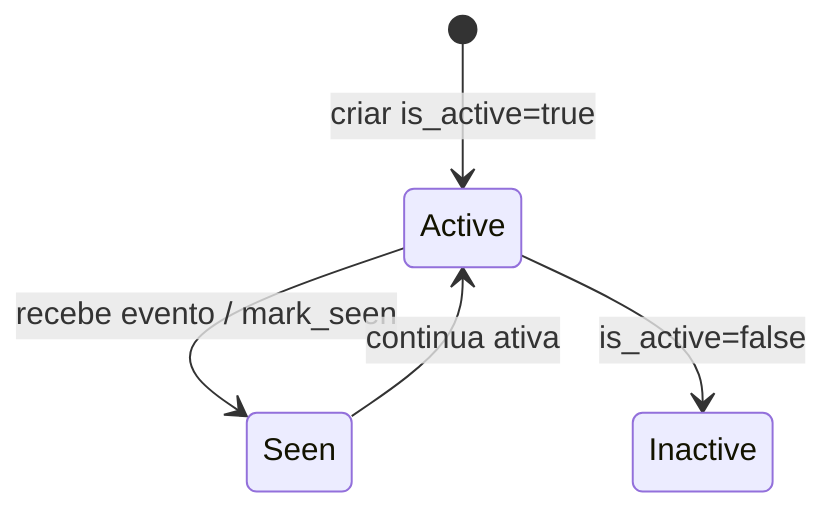

# Camera

Origem de eventos. Pode enviar eventos por push, ser lida por RTSP ou estar ligada a um gateway.

## Caso de uso

```text
Admin cria Camera
-> sistema gera camera_key
-> admin rotaciona token
-> camera envia evento com X-Camera-Token
-> ingest valida token
-> AccessEvent e criado
```

## Diagrama de estado



## Modelos

Origem: `cameras.models.Camera`.

Campos principais:

- `tenant`: unidade dona da camera.
- `camera_key`: chave publica usada no ingest.
- `connection_mode`: `direct_rtsp`, `push` ou `gateway`.
- `direction_default`: `entry`, `exit` ou `unknown`.
- `gateway`: gateway vinculado quando o modo for gateway.
- `host`, `port`, `rtsp_path`, `username`, `password_encrypted`: dados RTSP.
- `ingest_token_hash`: hash do token enviado em `X-Camera-Token`.
- `last_seen_at`, `is_active`: monitoramento operacional.

## Exemplos

```python
from cameras.models import Camera
from tenants.models import Tenant

tenant = Tenant.objects.get(slug="cond-jardim-azul")
camera = Camera.objects.create(
    tenant=tenant,
    name="Portaria Entrada",
    connection_mode=Camera.ConnectionMode.PUSH,
    direction_default=Camera.DirectionDefault.ENTRY,
)
token = camera.rotate_ingest_token()
```

## JSON e API

```http
POST /api/v1/cameras/
Authorization: Bearer eyJ...
Content-Type: application/json

{
  "tenant": 1,
  "name": "Portaria Entrada",
  "connection_mode": "push",
  "direction_default": "entry",
  "location": "Entrada social",
  "rotate_token": true
}
```

Ingest direto:

```http
POST /api/v1/ingest/cameras/{camera_key}/events/
X-Camera-Token: token_da_camera
Idempotency-Key: camera-event-0001
Content-Type: application/json

{
  "plate": "ABC1D23",
  "confidence": 0.95,
  "direction": "entry",
  "captured_at": "2026-05-23T14:00:00-03:00"
}
```

Endpoints:

- `GET /api/v1/cameras/`
- `POST /api/v1/cameras/`
- `GET /api/v1/cameras/{id}/`
- `PATCH /api/v1/cameras/{id}/`
- `POST /api/v1/cameras/{id}/rotate-token/`

## Webhook

Camera nao dispara webhook diretamente. O evento recebido por ela cria/finaliza `AccessEvent`, que pode disparar `access.event`.
