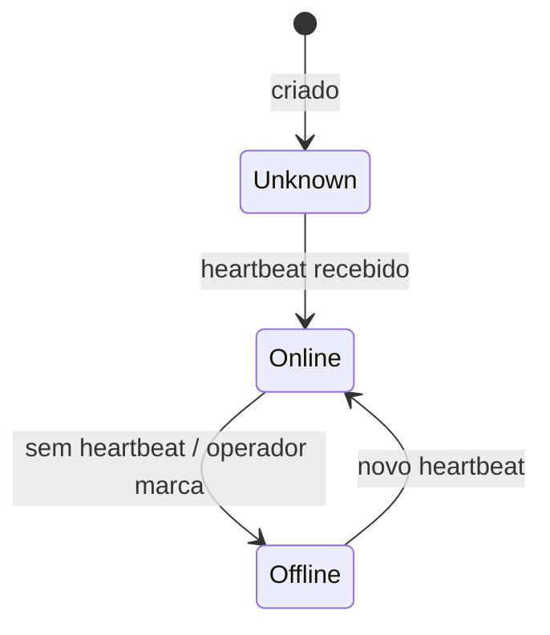

# Gateway

Servico local que recebe eventos na rede do cliente e envia ao servidor.

## Caso de uso

```text
Admin cria Gateway
-> sistema gera gateway_key e token
-> cameras locais enviam ao gateway
-> gateway envia eventos ao servidor
-> servidor atualiza status no heartbeat
```

## Diagrama de estado



## Modelos

Origem: `cameras.models.Gateway`.

Campos principais:

- `tenant`: unidade dona do gateway.
- `gateway_key`: chave publica usada no ingest.
- `token_hash`: hash do token enviado em `X-Gateway-Token`.
- `status`: `unknown`, `online` ou `offline`.
- `last_seen_at`, `version`, `pending_events`: saude do gateway.
- `cameras_online`, `cameras_offline`: resumo local das cameras.
- `is_active`: controla se o gateway pode enviar eventos.

## Exemplos

```python
from cameras.models import Gateway
from tenants.models import Tenant

tenant = Tenant.objects.get(id=1)
gateway = Gateway.objects.create(tenant=tenant, name="Gateway Portaria")
token = gateway.rotate_token()
gateway.mark_seen(version="edge-gateway-0.1", pending_events=0)
```

## JSON e API

```http
POST /api/v1/cameras/gateways/
Authorization: Bearer eyJ...
Content-Type: application/json

{
  "tenant": 1,
  "name": "Gateway Portaria",
  "location": "Guarita",
  "rotate_token": true,
  "is_active": true
}
```

Heartbeat:

```http
POST /api/v1/ingest/gateways/{gateway_key}/heartbeat/
X-Gateway-Token: token_do_gateway
Content-Type: application/json

{
  "version": "edge-gateway-0.1",
  "pending_events": 3,
  "cameras_online": 4,
  "cameras_offline": 1
}
```

Evento enviado pelo gateway:

```http
POST /api/v1/ingest/gateways/{gateway_key}/events/
X-Gateway-Token: token_do_gateway
Idempotency-Key: gateway-event-0001
Content-Type: application/json

{
  "camera_key": "camera_public_key",
  "plate": "ABC1D23",
  "confidence": 0.95,
  "direction": "entry"
}
```

## Webhook

Gateway nao dispara webhook diretamente. O evento aceito cria/finaliza `AccessEvent`, que pode disparar `access.event`.
