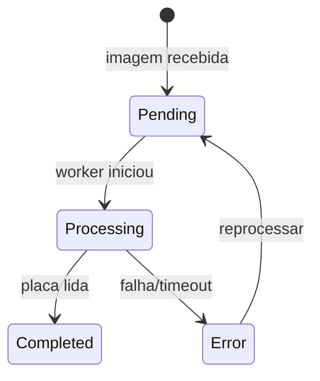

# PlateEvent

Evento bruto de OCR/LPR. Nasce quando chega imagem para leitura.

## Caso de uso

```text
Camera envia imagem sem plate
-> create_access_event cria PlateEvent PENDING
-> Celery process_plate_event marca PROCESSING
-> run_ocr_pipeline le placa
-> PlateEvent vira COMPLETED ou ERROR
-> AccessEvent vinculado e finalizado
```

## Diagrama de estado



## Modelos

Origem: `plates.models.PlateEvent`.

Campos principais:

- `camera`, `tenant`: origem e escopo.
- `event_type`: `entry`, `exit` ou `unknown`.
- `image`: imagem enviada para OCR.
- `captured_at`: horario de captura.
- `plate_text`, `confidence`: resultado do OCR.
- `status`: `pending`, `processing`, `completed` ou `error`.
- `raw_payload`, `pipeline_metadata`, `error_message`: diagnostico.

## Exemplos

```python
from django.core.files.base import ContentFile
from cameras.models import Camera
from plates.models import PlateEvent
from plates.tasks import process_plate_event

camera = Camera.objects.get(id=1)
event = PlateEvent.objects.create(
    tenant=camera.tenant,
    camera=camera,
    image=ContentFile(
        open("tests/image/plate_KNI4F64.png", "rb").read(),
        name="plate_KNI4F64.png",
    ),
)
process_plate_event.delay(event.id)
```

Em dev/test, o stub le a placa pelo nome do arquivo:

```text
plate_KNI4F64.png -> KNI4F64
```

## JSON e API

Upload manual:

```http
POST /api/v1/plates/upload/
Authorization: Bearer eyJ...
Content-Type: multipart/form-data

camera_id=1
event_type=entry
image=@plate_KNI4F64.png
```

Consulta:

```http
GET /api/v1/plates/events/?tenant_id=1
Authorization: Bearer eyJ...
```

Resposta resumida:

```json
{
  "id": 7,
  "camera": 1,
  "tenant": 1,
  "event_type": "entry",
  "plate_text": "KNI4F64",
  "confidence": "0.9500",
  "status": "completed",
  "raw_payload": {},
  "pipeline_metadata": {},
  "error_message": ""
}
```

## Webhook

Ao finalizar OCR:

- `plate.read`: quando o status vira `completed`.
- `plate.error`: quando o processamento falha.

Payload:

```json
{
  "event": "plate.read",
  "timestamp": "2026-05-23T14:00:00-03:00",
  "data": {
    "id": 7,
    "plate": "KNI4F64",
    "camera": "Portaria Entrada",
    "camera_id": 1,
    "event_type": "entry",
    "confidence": 0.95,
    "status": "completed",
    "captured_at": "2026-05-23T13:59:58-03:00",
    "error_message": ""
  }
}
```
