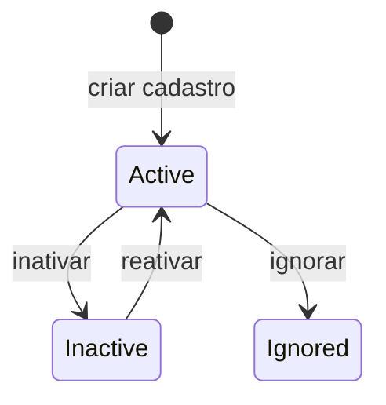

# PlateRegistry

Cadastro que diz se uma placa e liberada, bloqueada ou desconhecida.

## Caso de uso

```text
Admin cadastra placa
-> sistema normaliza placa
-> AccessEvent consulta PlateRegistry
-> decisao vira allowed, blocked, unknown ou manual_review
```

## Diagrama de estado



## Modelos

Origem: `plates.models.PlateRegistry`.

Campos principais:

- `tenant`: escopo da placa.
- `plate`, `normalized_plate`: valor informado e valor normalizado.
- `list_type`: `whitelist`, `blacklist` ou `unknown`.
- `status`: `active`, `inactive` ou `ignored`.
- `owner_name`, `owner_document`: dados do responsavel.
- `vehicle_model`, `vehicle_color`, `vehicle_type`: dados do veiculo.
- `valid_from`, `valid_until`: janela de validade.
- `block_reason`, `risk_level`, `notes`: contexto operacional.

Regra unica:

- `tenant + normalized_plate + list_type` deve ser unico.

## Exemplos

```python
from plates.access import normalize_plate
from plates.models import PlateRegistry
from tenants.models import Tenant

tenant = Tenant.objects.get(id=1)
PlateRegistry.objects.create(
    tenant=tenant,
    plate="ABC1D23",
    normalized_plate=normalize_plate("ABC1D23"),
    list_type=PlateRegistry.ListType.WHITELIST,
    owner_name="Joao Silva",
)
```

## JSON e API

```http
POST /api/v1/plates/registry/
Authorization: Bearer eyJ...
Content-Type: application/json

{
  "tenant": 1,
  "plate": "ABC1D23",
  "list_type": "whitelist",
  "status": "active",
  "owner_name": "Joao Silva",
  "vehicle_model": "Corolla",
  "vehicle_color": "prata",
  "risk_level": "medium"
}
```

Endpoints:

- `GET /api/v1/plates/registry/?tenant_id=1`
- `POST /api/v1/plates/registry/`
- `GET /api/v1/plates/registry/{id}/`
- `PATCH /api/v1/plates/registry/{id}/`
- `POST /api/v1/plates/registry/{id}/move-to-whitelist/`
- `POST /api/v1/plates/registry/{id}/move-to-blacklist/`
