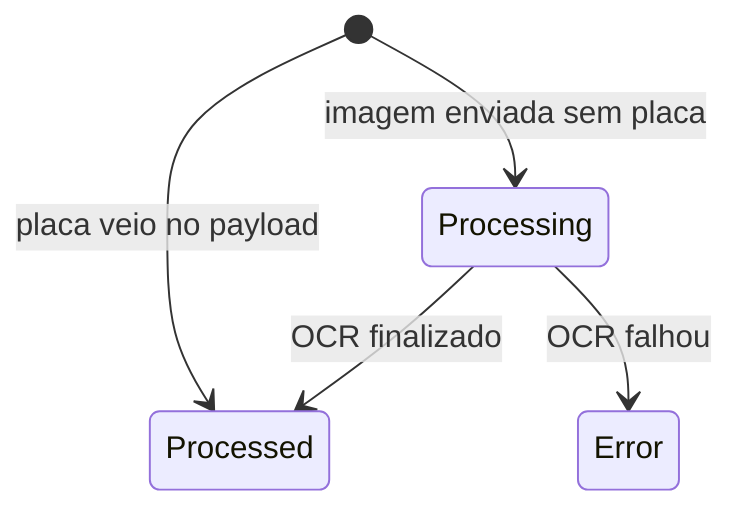

# AccessEvent

Evento operacional de entrada/saida. E a principal linha do tempo da portaria.

## Caso de uso

```text
Camera/gateway envia evento
-> create_access_event valida idempotencia
-> cria AccessEvent
-> se tem placa, classifica imediatamente
-> se tem imagem, aguarda PlateEvent/OCR
-> finalize_access_event atualiza decisao, presenca, alertas e webhook
```

## Diagrama de estado



## Modelos

Origem: `plates.models.AccessEvent`.

Campos principais:

- `event_uuid`: UUID publico do evento.
- `tenant`, `camera`, `gateway`: origem e escopo.
- `plate_event`: OCR vinculado quando houver imagem sem placa.
- `plate_registry`: cadastro encontrado na classificacao.
- `plate_text`, `normalized_plate`: placa bruta e normalizada.
- `list_type_result`: resultado de lista consultada.
- `decision`: `allowed`, `blocked`, `unknown`, `manual_review` ou `error`.
- `movement_type`: `entry`, `exit` ou `unknown`.
- `confidence`, `captured_at`, `received_at`, `processed_at`: leitura e tempos.
- `image`, `crop_image`, `raw_payload`: evidencias.
- `status`: `received`, `processing`, `processed` ou `error`.
- `idempotency_key`: evita duplicidade por camera/gateway.

## Exemplos

```python
from cameras.models import Camera
from plates.access import create_access_event

camera = Camera.objects.get(id=1)
event = create_access_event(
    camera=camera,
    payload={
        "plate": "ABC1D23",
        "confidence": 0.95,
        "direction": "entry",
    },
    idempotency_key="camera-event-0001",
)
```

## JSON e API

Ingest por camera:

```http
POST /api/v1/ingest/cameras/{camera_key}/events/
X-Camera-Token: token_da_camera
Idempotency-Key: camera-event-0001
Content-Type: application/json

{
  "plate": "ABC1D23",
  "confidence": 0.95,
  "direction": "entry",
  "captured_at": "2026-05-23T14:00:00-03:00"
}
```

Consulta e acoes:

- `GET /api/v1/plates/access-events/?tenant_id=1`
- `GET /api/v1/plates/access-events/{id}/`
- `POST /api/v1/plates/access-events/{id}/correct-plate/`
- `POST /api/v1/plates/access-events/{id}/mark-as-reviewed/`
- `POST /api/v1/plates/access-events/{id}/change-decision/`

Correcao de placa:

```json
{
  "plate": "ABC1D23",
  "reason": "Correcao manual pela portaria"
}
```

## Webhook

Ao finalizar o evento, o sistema dispara `access.event`.

Headers enviados:

- `Content-Type: application/json`
- `X-LPR-Event: access.event`
- `X-LPR-Signature: sha256=<hmac>`

Payload:

```json
{
  "event": "access.event",
  "timestamp": "2026-05-23T14:00:00-03:00",
  "data": {
    "id": 15,
    "event_uuid": "7b4cfc66-6504-49a4-8a16-28c8364e3c1b",
    "plate": "ABC1D23",
    "camera": "Portaria Entrada",
    "camera_id": 1,
    "gateway_id": null,
    "movement_type": "entry",
    "decision": "allowed",
    "confidence": 0.95,
    "captured_at": "2026-05-23T14:00:00-03:00",
    "decision_reason": "Plate is active in whitelist."
  }
}
```
