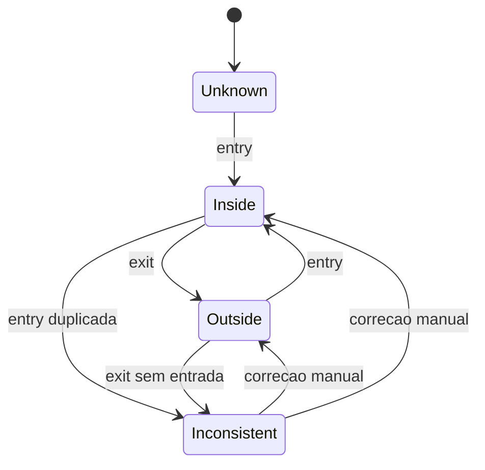

# VehiclePresence

Estado atual do veiculo dentro ou fora do local.

## Caso de uso

```text
AccessEvent PROCESSADO
-> update_vehicle_presence roda
-> entry coloca veiculo como inside
-> exit coloca veiculo como outside
-> entrada duplicada vira inconsistent
-> saida sem entrada vira inconsistent
```

## Diagrama de estado



## Modelos

Origem: `plates.models.VehiclePresence`.

Campos principais:

- `tenant`, `normalized_plate`: chave operacional por unidade.
- `plate_registry`: cadastro relacionado, quando existir.
- `current_status`: `inside`, `outside`, `inconsistent` ou `unknown`.
- `last_entry_event`, `last_exit_event`: ultimos eventos de movimento.
- `entered_at`, `exited_at`, `last_seen_at`: horarios de presenca.
- `location`: ultima localizacao conhecida.
- `inconsistency_reason`: motivo da inconsistencia.

Regra unica:

- `tenant + normalized_plate` deve ser unico.

## Exemplos

```python
from plates.access import update_vehicle_presence
from plates.models import AccessEvent

event = AccessEvent.objects.get(id=15)
presence = update_vehicle_presence(event)
```

## JSON e API

```http
GET /api/v1/plates/vehicle-presence/?tenant_id=1
Authorization: Bearer eyJ...
```

```http
GET /api/v1/plates/vehicle-presence/current-inside/?tenant_id=1
Authorization: Bearer eyJ...
```

Correcao manual:

```http
POST /api/v1/plates/vehicle-presence/8/manual-correction/
Authorization: Bearer eyJ...
Content-Type: application/json

{
  "current_status": "outside",
  "reason": "Saida confirmada manualmente"
}
```

## Webhook

Nao ha webhook especifico para `VehiclePresence`. A mudanca normalmente acontece durante a finalizacao de `AccessEvent`, que dispara `access.event`.
