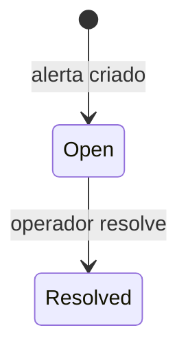

# Alert

Alerta operacional para eventos que exigem atencao.

## Caso de uso

```text
AccessEvent finalizado
-> create_alerts_for_event avalia decisao
-> blacklist gera alerta critical
-> unknown/manual_review gera alerta warning
-> operador resolve alerta
```

## Diagrama de estado



## Modelos

Origem: `plates.models.Alert`.

Campos principais:

- `alert_type`: `blacklist_detected`, `unknown_plate_detected`, `manual_review_required`, `gateway_offline`, `camera_offline`, `duplicate_entry` ou `exit_without_entry`.
- `tenant`, `access_event`, `camera`, `gateway`: contexto do alerta.
- `plate`: placa relacionada.
- `severity`: `info`, `warning` ou `critical`.
- `status`: `open` ou `resolved`.
- `message`, `notes`: mensagem e tratamento.
- `resolved_by`, `resolved_at`: resolucao.

## Exemplos

```python
from plates.models import Alert

alert = Alert.objects.get(id=3)
alert.status = Alert.Status.RESOLVED
alert.notes = "Seguranca acionada e ocorrencia encerrada"
alert.save(update_fields=["status", "notes", "updated_at"])
```

## JSON e API

```http
GET /api/v1/plates/alerts/?tenant_id=1
Authorization: Bearer eyJ...
```

Resolver:

```http
POST /api/v1/plates/alerts/3/resolve/
Authorization: Bearer eyJ...
Content-Type: application/json

{
  "notes": "Seguranca acionada"
}
```

## Webhook

Nao ha webhook proprio para `Alert`. Alertas sao efeitos colaterais da finalizacao de `AccessEvent`, que pode disparar `access.event`.
