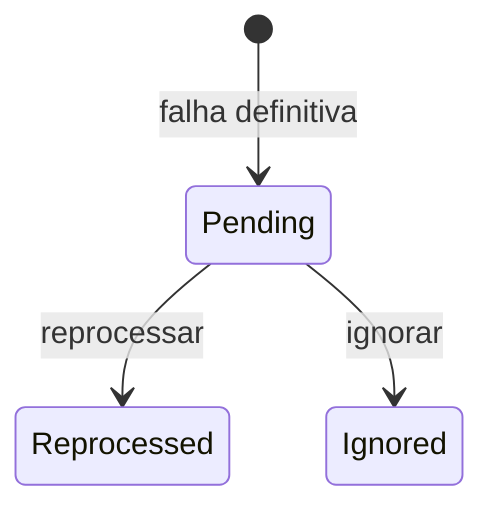

# DeadLetterTask

Registro de tarefa que falhou definitivamente.

## Caso de uso

```text
Celery tenta processar tarefa
-> falha repetidas vezes
-> _create_dead_letter cria DeadLetterTask
-> operador lista falhas
-> operador reprocessa
```

## Diagrama de estado



## Modelos

Origem: `common.models.DeadLetterTask`.

Campos principais:

- `task_name`, `task_id`, `queue`: tarefa e fila de origem.
- `tenant`: escopo, quando disponivel.
- `payload`: dados necessarios para reprocessar.
- `exception_class`, `exception_message`, `traceback`: erro original.
- `retries`: tentativas realizadas.
- `status`: `pending`, `reprocessed` ou `ignored`.
- `reprocessed_at`, `created_at`, `updated_at`: tempos.

## Exemplos

```python
from common.models import DeadLetterTask
from plates.tasks import reprocess_plate_event

failure = DeadLetterTask.objects.get(id=1)
event_id = failure.payload["event_id"]
reprocess_plate_event.delay(event_id)
failure.status = DeadLetterTask.Status.REPROCESSED
failure.save(update_fields=["status", "updated_at"])
```

## JSON e API

```http
GET /api/ops/dead-letter/?tenant_id=1
Authorization: Bearer eyJ...
```

Reprocessar:

```http
POST /api/ops/dead-letter/1/reprocess/
Authorization: Bearer eyJ...
```

## Webhook

Ao criar uma falha definitiva, `notify_dead_letter` dispara `task.dead_letter`.

Payload:

```json
{
  "event": "task.dead_letter",
  "timestamp": "2026-05-23T14:00:00-03:00",
  "data": {
    "id": 1,
    "task_name": "plates.tasks.process_plate_event",
    "task_id": "celery-task-id",
    "queue": "dead",
    "payload": {"event_id": 7},
    "exception_class": "ValueError",
    "exception_message": "OCR failed",
    "retries": 3,
    "created_at": "2026-05-23T14:00:00-03:00"
  }
}
```
