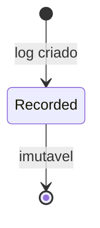

# AuditLog

Registro de auditoria para rastrear acoes importantes.

## Caso de uso

```text
Usuario executa acao sensivel
-> view/service chama write_audit_log
-> AuditLog guarda usuario, IP, path e valores
-> admin consulta historico
```

## Diagrama de estado



## Modelos

Origem: `common.models.AuditLog`.

Campos principais:

- `action`: nome da acao auditada.
- `tenant`, `user`: escopo e usuario.
- `ip_address`, `path`: origem da requisicao.
- `entity_type`, `entity_id`: entidade afetada.
- `old_value`, `new_value`: valores antes/depois.
- `reason`, `metadata`: justificativa e dados extras.
- `created_at`: horario do registro.

Usos existentes:

- Tentativas invalidas de ingest por camera/gateway.
- Correcao de placa.
- Marcacao de revisao.
- Mudanca manual de decisao.

## Exemplos

```python
from common.audit import write_audit_log

write_audit_log(
    request,
    "access_event.decision_changed",
    tenant=event.tenant,
    entity_type="AccessEvent",
    entity_id=str(event.id),
    old_value={"decision": "unknown"},
    new_value={"decision": "allowed"},
    reason="Liberacao manual",
)
```

## JSON e API

Nao ha endpoint REST dedicado para listar/criar `AuditLog`. A escrita e feita por codigo interno via `common.audit.write_audit_log`.

Formato interno esperado:

```json
{
  "action": "access_event.decision_changed",
  "tenant": 1,
  "user": 5,
  "entity_type": "AccessEvent",
  "entity_id": "15",
  "old_value": {"decision": "unknown"},
  "new_value": {"decision": "allowed"},
  "reason": "Liberacao manual",
  "metadata": {}
}
```
