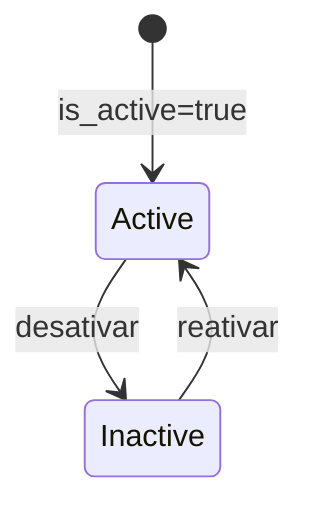

# WebhookSubscription

Configuracao de destino para eventos externos.

## Caso de uso

```text
Admin cadastra webhook
-> sistema salva secret criptografado
-> evento ocorre
-> dispatch_webhooks busca subscriptions ativas
-> cria WebhookDelivery para cada envio
```

## Diagrama de estado



## Modelos

Origem: `common.models.WebhookSubscription`.

Campos principais:

- `tenant`: escopo opcional da assinatura.
- `url`: destino HTTP.
- `event_type`: `plate.read`, `plate.error`, `access.event` ou `task.dead_letter`.
- `secret_encrypted`: segredo criptografado para assinatura HMAC.
- `is_active`: ativa ou pausa envios.
- `created_at`, `updated_at`: auditoria temporal.

## Exemplos

```python
from common.models import WebhookSubscription

subscription = WebhookSubscription(
    tenant=tenant,
    event_type=WebhookSubscription.EventType.ACCESS_EVENT,
    url="https://integrador.example.com/lpr",
)
subscription.set_secret("segredo")
subscription.save()
```

## JSON e API

```http
POST /api/ops/webhooks/
Authorization: Bearer eyJ...
Content-Type: application/json

{
  "tenant": 1,
  "url": "https://integrador.example.com/lpr",
  "event_type": "access.event",
  "secret": "segredo",
  "is_active": true
}
```

Endpoints:

- `GET /api/ops/webhooks/?tenant_id=1`
- `POST /api/ops/webhooks/`
- `GET /api/ops/webhooks/{id}/`
- `PATCH /api/ops/webhooks/{id}/`
- `DELETE /api/ops/webhooks/{id}/`

## Webhook

Esta model nao emite evento; ela configura quais eventos serao entregues.

Headers enviados em cada entrega:

- `Content-Type: application/json`
- `X-LPR-Event: <event_type>`
- `X-LPR-Signature: sha256=<hmac_sha256_do_corpo>`
