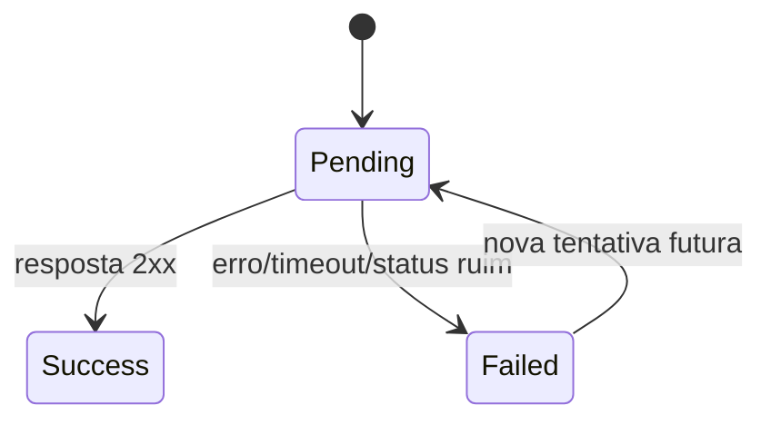

# WebhookDelivery

Historico de entrega de webhook.

## Caso de uso

```text
Evento disparado
-> delivery criado como pending
-> sistema envia HTTP POST
-> status vira success ou failed
-> operador consulta erro/resposta
```

## Diagrama de estado



## Modelos

Origem: `common.models.WebhookDelivery`.

Campos principais:

- `subscription`: assinatura usada no envio.
- `tenant`: escopo da entrega.
- `event_type`: evento entregue.
- `payload`: corpo JSON enviado.
- `status`: `pending`, `success` ou `failed`.
- `response_status_code`, `response_body`: resposta do integrador.
- `error_message`: erro de rede/status.
- `attempts`: quantidade de tentativas.
- `created_at`, `delivered_at`, `updated_at`: tempos.

## Exemplos

```python
from common.models import WebhookDelivery

failed = WebhookDelivery.objects.filter(status=WebhookDelivery.Status.FAILED)
for delivery in failed:
    print(delivery.subscription.url, delivery.error_message)
```

## JSON e API

```http
GET /api/ops/webhook-deliveries/?tenant_id=1
Authorization: Bearer eyJ...
```

Resposta resumida:

```json
{
  "id": 25,
  "tenant": 1,
  "subscription": 3,
  "subscription_url": "https://integrador.example.com/lpr",
  "event_type": "access.event",
  "payload": {"event": "access.event", "data": {"id": 15}},
  "status": "success",
  "response_status_code": 200,
  "response_body": "ok",
  "error_message": "",
  "attempts": 1,
  "delivered_at": "2026-05-23T14:00:02-03:00"
}
```

## Webhook

Representa a entrega de todos os webhooks. A task `deliver_webhook` envia o `payload` para `subscription.url` e calcula a assinatura com o secret da subscription.
