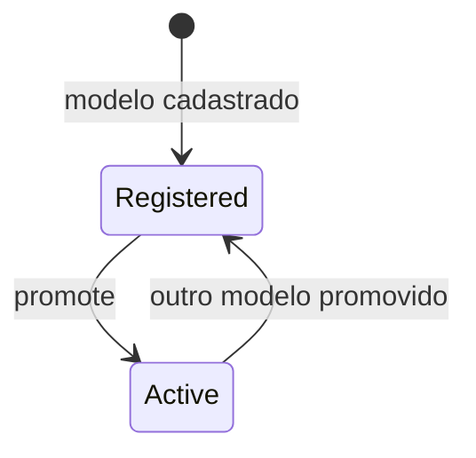

# AIModelArtifact

Registro de modelo de IA usado pelo pipeline.

## Caso de uso

```text
MLOps registra modelo
-> modelo fica salvo como artefato
-> promote_model ativa uma versao
-> pipeline_metadata passa a registrar versao ativa
```

## Diagrama de estado



## Modelos

Origem: `common.models.AIModelArtifact`.

Campos principais:

- `tenant`: escopo opcional do modelo.
- `kind`: `yolo` ou `ocr`.
- `version`: versao humana do artefato.
- `storage_uri`: caminho/URI do arquivo.
- `file_sha256`: hash do arquivo.
- `baseline_metrics`: metricas base em JSON.
- `notes`: observacoes.
- `is_active`, `promoted_at`: promocao da versao ativa.

Regra unica:

- `tenant + kind + version` deve ser unico.

## Exemplos

```python
from common.mlops import promote_model
from common.models import AIModelArtifact

artifact = AIModelArtifact.objects.create(
    kind=AIModelArtifact.Kind.YOLO,
    version="lpr-v1.pt",
    storage_uri="/models/lpr-v1.pt",
)
promote_model(artifact)
```

Comando:

```powershell
python manage.py register_model --kind yolo --model-version lpr-v1.pt --uri /models/lpr-v1.pt --promote
```

## JSON e API

```http
POST /api/ops/models/
Authorization: Bearer eyJ...
Content-Type: application/json

{
  "tenant": 1,
  "kind": "yolo",
  "version": "lpr-v1.pt",
  "storage_uri": "/models/lpr-v1.pt",
  "file_sha256": "abc123",
  "baseline_metrics": {"precision": 0.94, "recall": 0.91},
  "notes": "Modelo inicial"
}
```

Promover:

```http
POST /api/ops/models/5/promote/
Authorization: Bearer eyJ...
```
