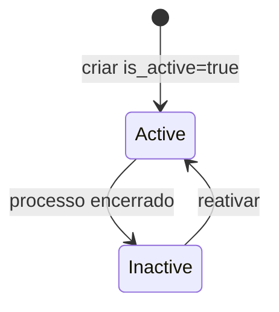

# DataProcessingRecord

ROPT/LGPD: registro de atividade de tratamento de dados.

## Caso de uso

```text
DPO/admin cadastra processo de tratamento
-> informa finalidade, base legal e retencao
-> sistema usa como inventario LGPD
-> auditoria/compliance consulta quando necessario
```

## Diagrama de estado



## Modelos

Origem: `common.models.DataProcessingRecord`.

Campos principais:

- `tenant`: escopo do processo.
- `name`: nome do tratamento.
- `purpose`: finalidade.
- `legal_basis`: base legal.
- `data_categories`: categorias de dados tratadas.
- `retention_days`: retencao em dias.
- `third_party_sharing`: compartilhamentos externos.
- `owner`: responsavel interno.
- `is_active`: processo ativo ou encerrado.

## Exemplos

```python
from common.models import DataProcessingRecord

DataProcessingRecord.objects.create(
    tenant=tenant,
    name="Controle de acesso por placa",
    purpose="Controle de entrada e saida",
    legal_basis="Legitimo interesse e seguranca",
    data_categories=["placa", "imagem", "horario", "local"],
    retention_days=90,
)
```

## JSON e API

```http
POST /api/ops/lgpd/ropt/
Authorization: Bearer eyJ...
Content-Type: application/json

{
  "tenant": 1,
  "name": "Controle de acesso por placa",
  "purpose": "Controle de entrada e saida",
  "legal_basis": "Legitimo interesse e seguranca",
  "data_categories": ["placa", "imagem", "horario", "local"],
  "retention_days": 90,
  "third_party_sharing": "Empresa de monitoramento",
  "owner": "DPO",
  "is_active": true
}
```

Endpoints:

- `GET /api/ops/lgpd/ropt/?tenant_id=1`
- `POST /api/ops/lgpd/ropt/`
- `GET /api/ops/lgpd/ropt/{id}/`
- `PATCH /api/ops/lgpd/ropt/{id}/`
