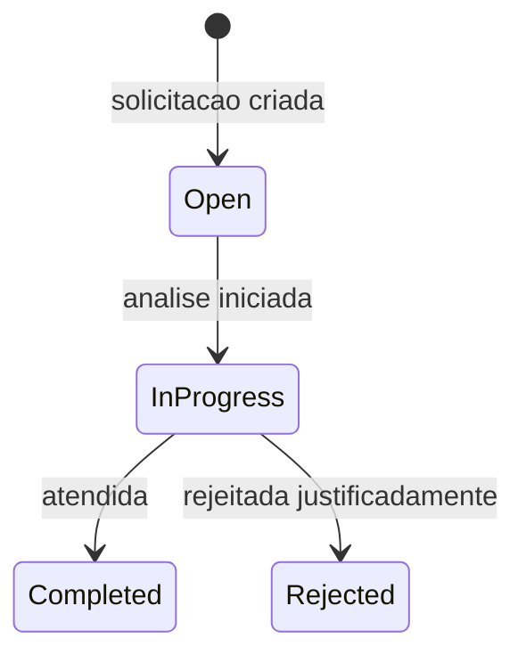

# DataSubjectRequest

Solicitacao LGPD feita por titular.

## Caso de uso

```text
Titular solicita acesso/correcao/exclusao
-> operador cria request
-> responsavel analisa dados por placa/tenant
-> request muda para completed ou rejected
```

## Diagrama de estado



## Modelos

Origem: `common.models.DataSubjectRequest`.

Campos principais:

- `tenant`: escopo da solicitacao.
- `request_type`: `access`, `correction`, `deletion` ou `objection`.
- `requester_name`, `requester_contact`: titular ou contato.
- `plate_text`: placa usada na busca.
- `status`: `open`, `in_progress`, `completed` ou `rejected`.
- `response_notes`: resposta/justificativa.
- `due_at`, `completed_at`: prazo e conclusao.

## Exemplos

```python
from common.models import DataSubjectRequest

request_obj = DataSubjectRequest.objects.create(
    tenant=tenant,
    request_type=DataSubjectRequest.RequestType.ACCESS,
    requester_name="Joao Silva",
    requester_contact="joao@example.com",
    plate_text="ABC1D23",
)
request_obj.status = DataSubjectRequest.Status.IN_PROGRESS
request_obj.save(update_fields=["status", "updated_at"])
```

## JSON e API

```http
POST /api/ops/lgpd/requests/
Authorization: Bearer eyJ...
Content-Type: application/json

{
  "tenant": 1,
  "request_type": "access",
  "requester_name": "Joao Silva",
  "requester_contact": "joao@example.com",
  "plate_text": "ABC1D23",
  "status": "open",
  "response_notes": "",
  "due_at": "2026-06-07T18:00:00-03:00"
}
```

Endpoints:

- `GET /api/ops/lgpd/requests/?tenant_id=1`
- `POST /api/ops/lgpd/requests/`
- `GET /api/ops/lgpd/requests/{id}/`
- `PATCH /api/ops/lgpd/requests/{id}/`
