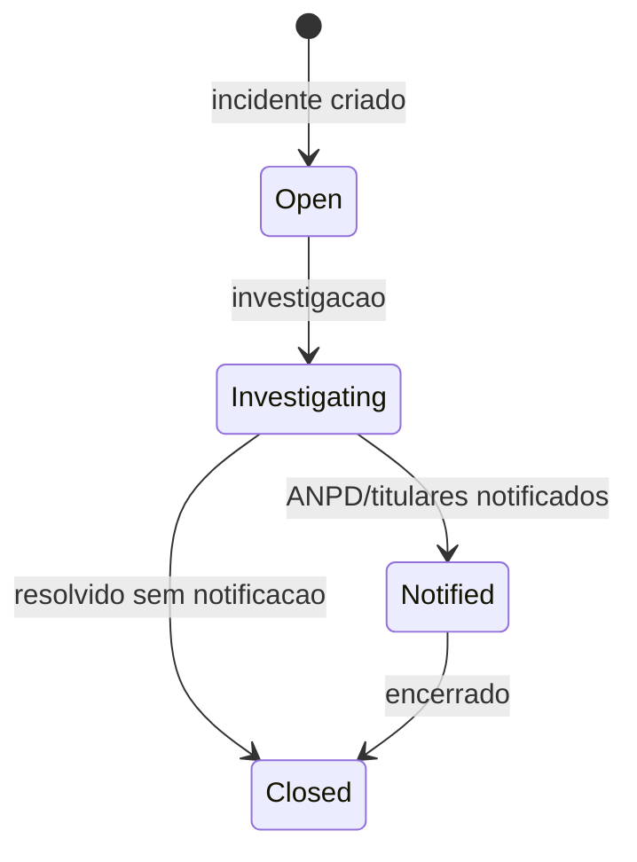

# SecurityIncident

Incidente de seguranca ou privacidade.

## Caso de uso

```text
Operador identifica incidente
-> cria SecurityIncident
-> time investiga
-> se necessario notifica ANPD
-> registra mitigacao
-> fecha incidente
```

## Diagrama de estado



## Modelos

Origem: `common.models.SecurityIncident`.

Campos principais:

- `tenant`: escopo do incidente.
- `title`, `description`: identificacao e detalhes.
- `status`: `open`, `investigating`, `notified` ou `closed`.
- `detected_at`: data de deteccao.
- `anpd_due_at`, `anpd_notified_at`: prazo e notificacao ANPD.
- `affected_data`: categorias afetadas.
- `mitigation_notes`: mitigacao e encerramento.

## Exemplos

```python
from django.utils import timezone
from common.models import SecurityIncident

incident = SecurityIncident.objects.create(
    tenant=tenant,
    title="Exposicao indevida de imagens",
    description="URL de imagem ficou acessivel sem autenticacao",
    status=SecurityIncident.Status.OPEN,
    detected_at=timezone.now(),
    affected_data=["imagem", "placa", "horario"],
)
incident.status = SecurityIncident.Status.INVESTIGATING
incident.save(update_fields=["status", "updated_at"])
```

## JSON e API

```http
POST /api/ops/lgpd/incidents/
Authorization: Bearer eyJ...
Content-Type: application/json

{
  "tenant": 1,
  "title": "Exposicao indevida de imagens",
  "description": "URL de imagem ficou acessivel sem autenticacao",
  "status": "open",
  "detected_at": "2026-05-23T14:00:00-03:00",
  "anpd_due_at": "2026-05-25T14:00:00-03:00",
  "affected_data": ["imagem", "placa", "horario"],
  "mitigation_notes": ""
}
```

Endpoints:

- `GET /api/ops/lgpd/incidents/?tenant_id=1`
- `POST /api/ops/lgpd/incidents/`
- `GET /api/ops/lgpd/incidents/{id}/`
- `PATCH /api/ops/lgpd/incidents/{id}/`
